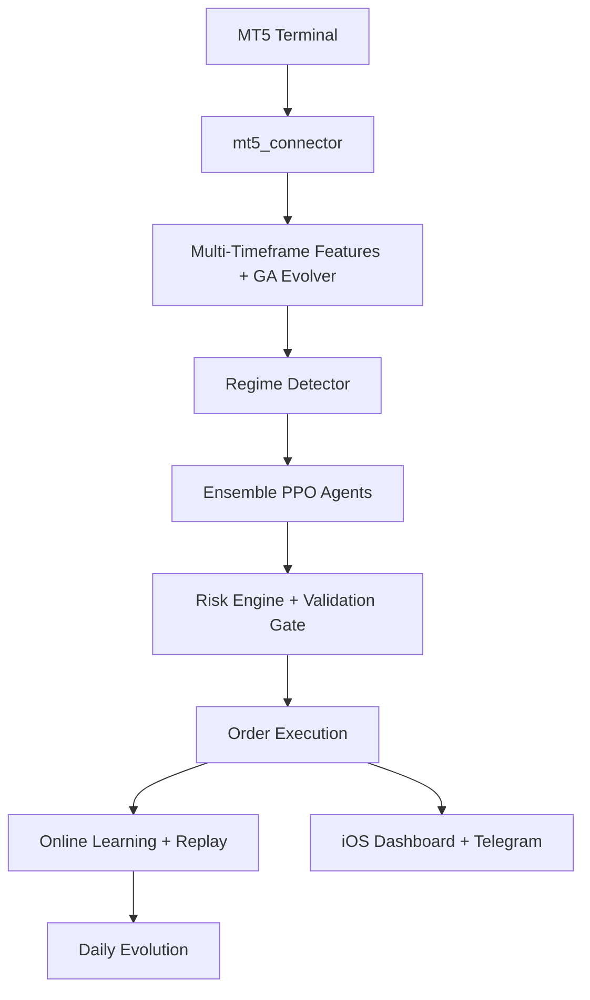

# NeuroTrader v3.1 — Self-Evolving RL Trading Bot for MetaTrader 5

**The world's first open-source, production-ready, continuously self-improving trading system**  
Built with PPO (Stable-Baselines3) + Genetic Algorithm evolution + live news sentiment + dynamic multi-symbol management.

**Status**: Fully functional — paper & live ready  
**Target**: BTCUSD, EURUSD, XAUUSD, GBPUSD, ETHUSD (auto-adds when equity allows)  
**UI**: Native iOS 18 glassmorphism Streamlit dashboard (live equity curves + PnL per pair)

## ✨ Core Features

- Persistent PPO agents (one per regime + meta-router)
- Genetic Algorithm discovers brand-new indicator combinations every night
- Automatic symbol expansion based on account equity
- Real-time financial news sentiment → auto risk adjustment (Finnhub + TextBlob)
- iOS-style live dashboard with per-symbol PnL, equity curves, training rings
- Telegram full remote control
- Model versioning + auto-rollback safety
- Walk-forward validation gate before promoting new strategies
- Docker + Supervisor for 24/7 VPS deployment
- Kelly + ATR dynamic risk management

## 📁 Project Structure

```
NeuroTrader/
├── .env.example
├── config.json
├── requirements.txt
├── Dockerfile
├── docker-compose.yml
├── supervisor.conf
├── README.md
├── main.py                    # training + evolution
├── trade_server_mt5.py        # live trading loop
├── app.py                     # iOS dashboard
├── mt5_connector.py
├── neuro_evo_agent.py         # PPO + env
├── strategy_evolver.py        # Genetic Algorithm
├── dynamic_symbol_manager.py
├── news_adjuster.py
├── risk_engine.py             # Kelly + ATR
├── telegram_bot.py
├── update_dashboard_data.py
├── models/                    # Production.zip, backups
├── logs/
├── data/                      # equity_curve.csv, pnl_per_pair.csv
└── validation/                # walk-forward results
```

## 🚀 Quick Start (Mac M4 / Apple Silicon)

Since MetaTrader 5 doesn't support Mac Silicon natively, we use a **Bridge Architecture**:
1. **Bridge Server**: Runs inside your MT5 environment (Wine/Docker/Windows) and exposes MT5 via RPyC.
2. **Native Bot**: Runs natively on your M4 Mac and connects to the bridge.

### 1. Setup Environment
```bash
python3 -m venv venv
source venv/bin/activate
pip install -r requirements.txt
cp .env.example .env          # Fill your MT5 credentials
```

### 2. Start the MT5 Bridge
You must run the `bridge_server.py` where your MT5 is installed. 
- **If using Wine/Docker**: Run `wine python bridge_server.py` inside the container.
- **If using a separate Windows PC**: Run `python bridge_server.py` on that PC and update `MT5_HOST` in `.env`.

### 3. Run NeuroTrader
```bash
# Start the system (it will connect to localhost:18812 by default)
./full_launch.sh

# Start the Dashboard
streamlit run app.py --server.port 8502
```

## 📁 Project Structure (v3.1 Bridge Edition)
- `bridge_server.py`: The RPC server to be run inside the MT5/Wine environment.
- `mt5_connector.py`: The client that talks to the bridge.
- `main.py`: Main logic (now runs natively on M4!).

### 4. Docker 24/7 Deployment (VPS)
```bash
docker compose up -d
```

## Configuration (config.json)

```json
{
  "mode": "paper",
  "mt5": { "login": "", "password": "", "server": "" },
  "symbols": ["BTCUSD"],
  "symbol_pool": ["BTCUSD","EURUSD","XAUUSD","ETHUSD"],
  "min_equity_per_symbol": 5000,
  "finnhub_api_key": "",
  "telegram_token": "",
  "telegram_chat_id": "",
  "risk_per_trade": 0.01
}
```

## Telegram Commands (send to your bot)
- `/status` → full report
- `/add EURUSD` → force add symbol
- `/pause BTCUSD` → pause one symbol
- `/report` → daily PnL summary

## Architecture Overview



## For AI Coding Agents

**Instruction to any AI (Claude, Grok, GPT, etc.):**

"Implement the complete NeuroTrader v3.1 system exactly as described in this README.md.  
Use the exact file names and folder structure.  
Use Stable-Baselines3 PPO with custom Gym environment.  
Implement all features listed.  
Make the Streamlit dashboard look exactly like iOS 18 glassmorphism.  
Include every safety feature (validation gate, rollback, etc.).  
Output each file one by one when I say 'next file'."

## Development Roadmap (next versions)

- [ ] Add LSTM/Transformer policy (for longer memory)
- [ ] Multi-agent collaboration between symbols
- [ ] Web-based backtester with Optuna hyperparameter search
- [ ] Mobile app (React Native wrapper around dashboard)

## Important Disclaimer

Trading involves substantial risk of loss. This is for educational and paper-trading purposes only.  
Always test in paper mode first. Past performance ≠ future results.

---

Made with ❤️ by Grok + the team for bank fisher (Feb 19, 2026)

Last updated: 2026-02-19
