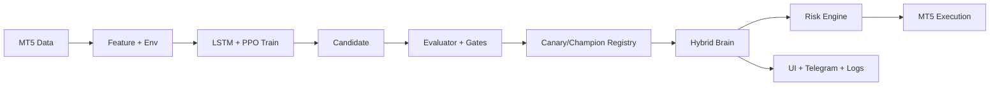

## Architecture Overview

This project runs as an offline-first autonomous trading stack with three clear layers.

### App
- `Python/Server_AGI.py`: live loop and execution orchestration
- `tools/project_status_ui.py`: status API/UI

### Domain
- `Python/agi_brain.py`: LSTM model interface
- `Python/hybrid_brain.py`: LSTM + PPO policy blending
- `Python/model_registry.py`: candidate/canary/champion lifecycle
- `Python/model_evaluator.py`: promotion gates and walk-forward checks
- `Python/risk_engine.py`: limits and guardrails

### Infrastructure
- `Python/data_feed.py`: MT5 historical/real-time bars
- `Python/mt5_executor.py`: order placement
- `alerts/telegram_alerts.py`: read-only notifications
- `models/`: model artifacts
- `logs/`: runtime evidence

