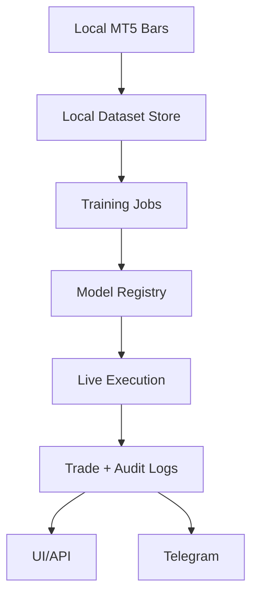

## Sync Flow

The system is offline-first for training artifacts and runtime state, then synchronizes state to external systems.

1. Local storage receives bars from MT5 and writes training datasets.
2. Training jobs generate candidate models and scorecards.
3. Evaluator compares candidate vs active champion/canary.
4. Registry updates active pointers per symbol.
5. Live server loads active model and executes via MT5.
6. UI and Telegram receive event updates from logs/runtime API.

